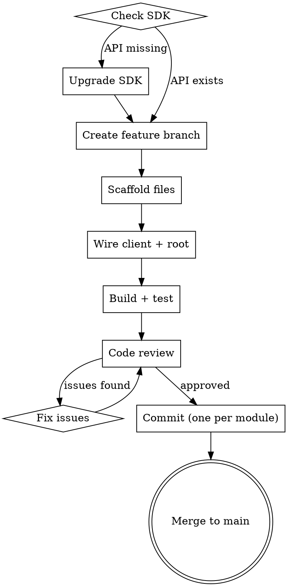

# Adding a New Module to gate-cli

## Overview

Each module maps to one Gate API service (e.g. `tradfi`, `alpha`). Follow this workflow end-to-end — including the merge back to main — every time.

## Workflow



## Step 1 — Check SDK Readiness

Search the SDK for the API service:

```bash
grep -n "<Module>Api\|<Module>ApiService" \
  ~/projects/go/pkg/mod/github.com/gate/gateapi-go/v7@<version>/client.go
```

If the service is missing, upgrade to the latest available version:

```bash
go list -m -versions github.com/gate/gateapi-go/v7 | tr ' ' '\n' | tail -5
go get github.com/gate/gateapi-go/v7@<latest>
go build -o gate-cli . # verify existing code still compiles after upgrade
```

## Step 2 — Create Feature Branch

Load `git-branch-flow` skill, then:

```bash
git checkout main && git pull
git checkout -b feature/<module-name>-module
```

## Step 3 — Read the SDK

Before writing any code, inspect the API service:

```bash
# List all methods
grep "^func (a \*<Module>ApiService)" /path/to/api_<module>.go

# Read every model struct used by those methods
cat /path/to/model_*.go | grep -A 20 "type <Model> struct"

# Read Opts structs (optional params)
grep -A 10 "type List.*Opts struct" /path/to/api_<module>.go
```

Record exact field names and types — they often differ from what you'd guess (e.g. `TradFiOrderRequest` not `InlineObject2`, `int64` not `int32`).

## Step 4 — Scaffold Files

Create `cmd/cex/<module>/` with one file per subgroup:

```
cmd/cex/<module>/
  <module>.go   — root Cmd only
  market.go     — public endpoints (no auth)
  account.go    — account/balance endpoints (auth)
  order.go      — order CRUD (auth)
  position.go   — position management (auth), if applicable
```

### <module>.go (always)

```go
package <module>

import "github.com/spf13/cobra"

var Cmd = &cobra.Command{
    Use:   "<module>",
    Short: "<Module> trading commands",
}
```

### Three-level command structure: `{module} {group} {action}`

All modules follow a strict three-level hierarchy (matching spot/futures/tradfi):

```
gate-cli <module> <group> <action>
# e.g.:
gate-cli options market tickers
gate-cli options order list
gate-cli options position get
gate-cli delivery account book
gate-cli wallet balance total
```

**Never** add leaf commands directly under the module root. Always use a group.

### Group + leaf command pattern

Each file declares its group command at **package level** (not inside `init()`), then registers leaf commands inside `init()`:

```go
// Package-level group var — visible across files in the package
var marketCmd = &cobra.Command{
    Use:   "market",
    Short: "<Module> market data (public, no authentication required)",
}

func init() {
    tickersCmd := &cobra.Command{
        Use:   "tickers",         // ← action verb / noun, NOT "list-tickers"
        Short: "List <module> tickers (public, no authentication required)",
        RunE:  runModuleTickers,
    }
    tickersCmd.Flags().String("underlying", "", "Underlying name (required)")
    tickersCmd.MarkFlagRequired("underlying")

    // more leaf commands...

    marketCmd.AddCommand(tickersCmd, ...)   // leaf → group
    Cmd.AddCommand(marketCmd)               // group → module root
}
```

**Leaf command naming** — use short action-style names, not API-mapping names:

| ❌ Don't use (API mapping) | ✅ Use (action style) |
|---|---|
| `orders` | `list` |
| `create-order` | `create` |
| `cancel-orders` | `cancel-all` |
| `cancel-order` | `cancel` |
| `amend-order` | `amend` |
| `positions` | `list` |
| `position` | `get` |
| `position-close` | `close` |
| `account-book` | `book` |
| `my-settlements` | `settlements` |
| `total-balance` | `total` |
| `sub-balances` | `sub` |

Keep descriptive names when there is no simpler action form (`update-margin`, `my-trades`, `countdown-cancel-all`, `sub-to-sub`, etc.).

### Runner function pattern

```go
func runXxx(cmd *cobra.Command, args []string) error {
    p := cmdutil.GetPrinter(cmd)
    c, err := cmdutil.GetClient(cmd)
    if err != nil {
        return err
    }
    // auth-required commands only:
    if err := c.RequireAuth(); err != nil {
        return err
    }

    result, httpResp, err := c.<Module>API.SomeMethod(c.Context(), ...)
    if err != nil {
        p.PrintError(client.ParseGateError(err, httpResp, "GET", "/path", ""))
        return nil
    }
    if p.IsJSON() {
        return p.Print(result)
    }
    return p.Table([]string{"Col1", "Col2"}, rows)
}
```

Key rules:
- **Public endpoints** — no `RequireAuth()` call, document in Short as "(public, no authentication required)"
- **Error path** — always `p.PrintError(...)` then `return nil` (not `return err`)
- **Optional SDK params** — use `optional.NewString(v)` / `optional.NewInt32(v)` etc.; only set when the flag has a non-zero value
- **Write operations** — `json.Marshal(req)` for the body arg to `ParseGateError`; call `p.Print(result)` directly (no table for single-record write responses)

### Standard group names

Use these group names consistently across modules:

| Group | Contents |
|---|---|
| `market` | Public market data: tickers, order-book, candlesticks, trades, contracts |
| `account` | Account info (`get`), account book (`book`), settlements |
| `order` | `list`, `create`, `get`, `cancel`, `cancel-all`, `amend` |
| `position` | `list`, `get`, `close`, `update-*`, `liquidates`, `settlements` |
| `balance` | `total`, `sub`, `sub-margin`, `sub-futures`, `sub-cross-margin`, `small`, etc. |
| `transfer` | `create`, `to-sub`, `sub-to-sub`, `status`, `sub-list` |
| `deposit` | `address`, `list`, `withdrawals`, `saved`, `push-orders` |
| `mmp` | `get`, `set`, `reset` |
| `price-trigger` | `list`, `create`, `get`, `cancel`, `cancel-all` |

## Step 5 — Wire Client and Root

**`internal/client/client.go`** — add the API field:

```go
type Client struct {
    SpotAPI    *gateapi.SpotApiService
    FuturesAPI *gateapi.FuturesApiService
    TradFiAPI  *gateapi.TradFiApiService
    AlphaAPI   *gateapi.AlphaApiService
    // add here: <Module>API *gateapi.<Module>ApiService
}

// and in New():
return &Client{
    // ...
    <Module>API: apiClient.<Module>Api,  // note: SDK uses lowercase 'i' in Api
}
```

**`cmd/cex/cex.go`** — register the command under the `cex` group:

```go
import "github.com/gate/gate-cli/cmd/cex/<module>"
// in init():
Cmd.AddCommand(<module>.Cmd)
```

(`cmd/root.go` already adds `cex.Cmd`; do not register business modules on `rootCmd` directly.)

## Step 6 — Build and Test

```bash
go build -o gate-cli .
go test ./...
./gate-cli cex <module> --help            # verify group structure
./gate-cli cex <module> market --help     # verify leaf commands
```

Fix any field-name mismatches against actual SDK model files (the agent's guess about field names is often wrong — always verify).

## Step 7 — Code Review

Dispatch code review before committing:

```
task(subagent_type="superpowers:code-reviewer")
```

Provide: changed files, SDK field names used, requirements context.
Fix all issues, re-review if needed.

## Step 8 — Commit (one commit per module added)

When SDK was upgraded in the same session, include `go.mod`/`go.sum` in the module's commit:

```bash
git add cmd/cex/cex.go cmd/cex/<module>/ internal/client/client.go go.mod go.sum
git commit -m "feat(<module>): add <module> module with full API coverage

Adds N commands across M files:
- market: <leaf commands> (all public)
- account: <leaf commands>
- order: <leaf commands>
- position: <leaf commands>

Co-Authored-By: Claude Sonnet 4.6 <noreply@anthropic.com>"
```

If multiple modules were added in one session, stage and commit each separately.

## Step 9 — Merge Back to Main

```bash
git checkout main
git merge --no-ff feature/<module-name>-module -m "Merge feature/<module-name>-module into main

Co-Authored-By: Claude Sonnet 4.6 <noreply@anthropic.com>"
```

**Do not skip this step.** The feature branch should not be left dangling after the work is complete.

## Common Mistakes

| Mistake | Fix |
|---|---|
| Flat commands under module root | Always use a group: `{module} {group} {action}` |
| Declaring `var groupCmd` inside `init()` | Declare at package level so it can be referenced in `AddCommand` outside `init()` |
| Using API-mapping names (`orders`, `create-order`) | Use action names (`list`, `create`) — see naming table above |
| Using guessed model field names | Always read the actual `model_*.go` files before coding |
| SDK has renamed `InlineObjectN` types | Check current type names after any upgrade |
| Forgot `RequireAuth()` on a private endpoint | Mark public commands explicitly in `Short` to make the distinction visible |
| `AlphaAPI` vs `AlphaApi` | SDK fields use lowercase `i` (`apiClient.AlphaApi`); our Client struct uses uppercase `I` (`AlphaAPI`) |
| Committing all modules in one commit | One `git commit` per module — keep history clean |
| Forgetting to merge back to main | Always end with the merge step |
